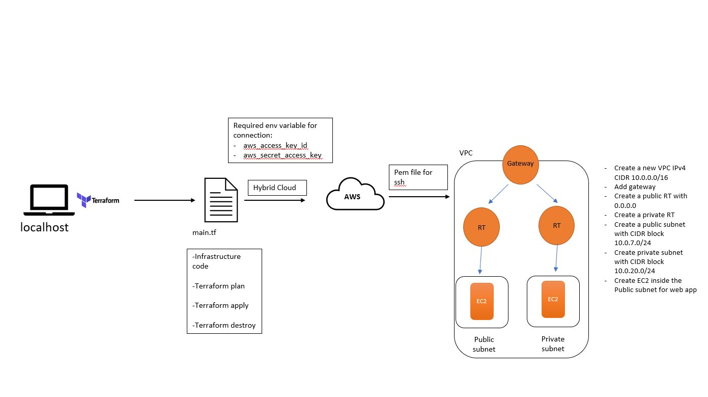

# Terraform


### Installing terraform on local host

1. Terraform can be installed using;

```
brew tap hashicorp/tap

brew install hashicorp/tap/terraform
```

2. Then need to update 

```
brew update

brew upgrade hashicorp/tap/terraform
```

### Connecting to AWS

1. We then need to make environment variables to store our access credentials to AWS, within `terraform` directory

```
export AWS_ACCESS_KEY_ID=<add_your_access_ID>

export AWS_SECRET_ACCESS_KEY=<add_your_access_secrect_key>

export AWS_DEFAULT_REGION="eu-west-1"
```

We can check they exist by using `printenv`

2. within a new bash terminal as admin, create a new file with 

```
sudo nano main.tf
```

3. Within this file add the following code:

```
# who is the provider - AWS
# how to codify with terraform - syntax - name of resource {key = value} {sdfsdg}
# most commonly used commands - terraform init - terraform plan - terraform apply

# create a service on AWS
# which service? - EC2
resource "aws_instance" "app_instance" {
        # which ami to use? - ami i.d
        ami = "ami-0f3c9f7c389db8829"
        # type of instance?
        instance_type = "t2.micro"
        # do you need the public ip?
        associate_public_ip_address = true
        # what would you like to name it?
        tags = {
            Name = "tech221_reis_terraform_app"
        }
}
```

4. Now we need to initialise Terraform 

```
terraform init
```

5. We can check the plan we have created, to see if the plan is acceptable

```
terraform plan
```

6. We can put this plan into action and launch an EC2 instance, using the AMI provided

```
terraform apply
```

7. We can terminate this instance with 

```
terraform destroy
```

### Create a VPC with Terraform 



1. within our main.tf we need to add this code for the different components of a VPC

```
# Create VPC within AWS resource
resource "aws_vpc" "main" {
 cidr_block = var.vpc_cidr_block

 tags = {
   Name = "Reis_tech221_VPC_terraform"
 }
}


# Create Subnets
resource "aws_subnet" "public_subnets" {
 vpc_id     = aws_vpc.main.id
 cidr_block = var.public_subnet_cidrs
 map_public_ip_on_launch = "true"
 availability_zone = "eu-west-1"

 tags = {
   Name = "Reis_tech221_public_subnet"
 }
}

resource "aws_subnet" "private_subnets" {
 vpc_id     = aws_vpc.main.id
 cidr_block = var.private_subnet_cidrs

 tags = {
   Name = "Reis_tech221_private_subnet"
 }
}

# Set-up internet Gate-way
resource "aws_internet_gateway" "gw" {
 vpc_id = aws_vpc.main.id
 
 tags = {
   Name = "Reis_tech221_VPC_IG_Terraform"
 }
}
  
# Create Route Table
resource "aws_route_table" "public_rt" {
  vpc_id = aws_vpc.main.id

  route {
    cidr_block = var.rt_cidr_block
    gateway_id = aws_internet_gateway.gw.id
  }
 
  route {
    ipv6_cidr_block = var.ipv6_cidr_block
    gateway_id      = aws_internet_gateway.gw.id
  }
    
  tags = {
    Name = "Public Route Table"
  }
}
    
# Make it accessable over internet
    
resource "aws_route_table_association" "public_1_rt_a" {
  subnet_id      = aws_subnet.public_subnets.id
  route_table_id = aws_route_table.public_rt.id
}

# Create SG

resource "aws_security_group" "web_sg" {
  name   = "HTTP and SSH" 
  vpc_id = aws_vpc.main.id
        
  ingress {
    from_port   = 80
    to_port     = 80
    protocol    = "tcp"
    cidr_blocks = [var.rt_cidr_block]
  }
  
  ingress {
    from_port   = 22
    to_port     = 22
    protocol    = "tcp"
    cidr_blocks = [var.rt_cidr_block]
  }

  ingress {
    from_port   = 3000
    to_port     = 3000
    protocol    = "tcp"
    cidr_blocks = [var.rt_cidr_block]
  }

# Outbound rules 

  egress {
    from_port   = 0
    to_port     = 0
    protocol    = "-1" # allow all
    cidr_blocks = [var.rt_cidr_block]
  }

  tags = {
        Name = "Reis_Tech221_SG"
  }
}


# let's create a service on AWS
# which service -EC2
resource "aws_instance" "app_instance" {
        # which AMI to use
        ami = var.ami_id
        instance_type = "t2.micro"
        # do you need the public IP
        associate_public_ip_address = true
        key_name = "tech221"
    
        subnet_id                   = aws_subnet.public_subnets.id
        vpc_security_group_ids      = [aws_security_group.web_sg.id]
  
        tags = {
          Name = "tech221_reis_terraform_app"
    
        }
}  
```

2. Then within our `variable.tf` file we need to add

```
variable "ami_id" {
    default = "ami-09c92f12073c29174"
}

variable "public_subnet_cidrs" {
 type        = string
 description = "Public Subnet CIDR values"
 default     = "10.0.1.0/24"
}
 
variable "private_subnet_cidrs" {
 type        = string
 description = "Private Subnet CIDR values"
 default     = "10.0.2.0/24"
}

variable "vpc_cidr_block" {
    default = "10.0.0.0/16"
}

variable "rt_cidr_block" {
    default = "0.0.0.0/0"
}

variable "ipv6_cidr_block" {
    default = "::/0"
}
```

3. On Our git bash terminal we can now do 

```
terraform plan

terraform apply
```
