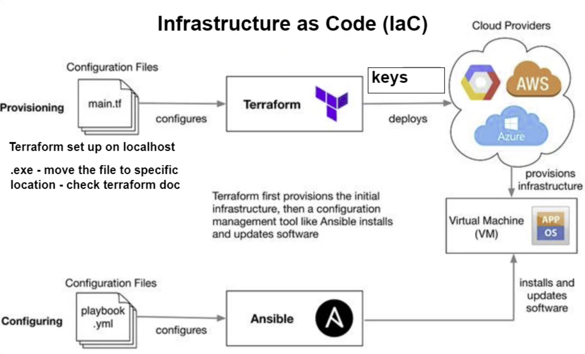

# Terraform



### Installing terraform on local host

1. Terraform can be installed using;

```
brew tap hashicorp/tap

brew install hashicorp/tap/terraform
```

2. Then need to update 

```
brew update

brew upgrade hashicorp/tap/terraform
```

### Connecting to AWS

1. We then need to make environment variables to store our access credentials to AWS, within `terraform` directory

```
export AWS_ACCESS_KEY_ID=<add_your_access_ID>

export AWS_SECRET_ACCESS_KEY=<add_your_access_secrect_key>
```

We can check they exist by using `printenv`

2. within a new bash terminal as admin, create a new file with 

```
sudo nano main.tf
```

3. Within this file add the following code:

```
# who is the provider - AWS
# how to codify with terraform - syntax - name of resource {key = value} {sdfsdg}
# most commonly used commands - terraform init - terraform plan - terraform apply

provider "aws" {
        region = "eu-west-1"

}
# create a service on AWS
# which service? - EC2
resource "aws_instance" "app_instance" {
        # which ami to use? - ami i.d
        ami = "ami-0f3c9f7c389db8829"
        # type of instance?
        instance_type = "t2.micro"
        # do you need the public ip?
        associate_public_ip_address = true
        # what would you like to name it?
        tags = {
            Name = "tech221_reis_terraform_app"
        }
}
```

4. Now we need to initialise Terraform 

```
terraform init
```

5. We can check the plan we have created, to see if the plan is acceptable

```
terraform plan
```

6. We can put this plan into action and launch an EC2 instance, using the AMI provided

```
terraform apply
```

7. We can terminate this instance with 

```
terraform destroy
```